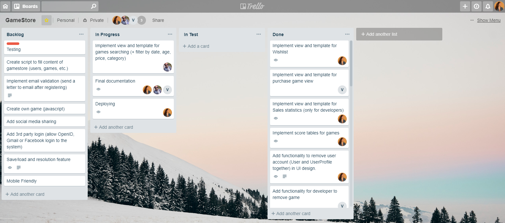

# Game Store

Online Game Store for JavaScript games &ndash; Project for Web Software Development course at Aalto University.

## Links

#### App in Heroku
[online-gamestore.herokuapp.com/](http://online-gamestore.herokuapp.com/search_game/)

#### Project Plan
[Project Plan](project plan.md)

#### Description

This project is a prototype of real game store service which provides functionality for players and game developers. Players can search games, buy them, save to wishlist and play. Developers can add new games through external link to html page with JavaScript game. Also, they are able to track number and dates of games sales.

Game Store uses Django Framework (Python 3.6) and such tools as Bootstrap, JQuery, HighCharts.

## Instructions to use application

Online Game Store is hosted at [Heroku](http://online-gamestore.herokuapp.com/search_game/).

#### User functionality in general

A guest user is able to search games and see game details. Other functionality (buy, save, play) is available after authorization.

To register in our service you should click to 'Sign Up' and provide the following data: username, first name, last name, email, birthday, gender, password and mark that you read User Agreement (you can read by the link).

Note that user must be at least 14 years old and at most 120 years old. The first limitation is due to cash transactions when purchasing games. In our service, people under the age of 14 do not have the authority to perform these operations. The second restriction is added to avoid fictional dates.

After registration, you get an email with the link on address that you provided. Please click on this link, thus, we can validate your email address and make your user profile active.

When you confirm your email, you can login. Click 'Login' and type your username and password.

All new users have 'Player' role that means that you can only player functionality (search, buy, save, play). If you want to upload your own games and track statistics, please, change your role to 'Developer' on profile page.

Click 'Profile' on sidebar menu. Here your current personal data is shown, and you can update it, change your password or delete account. To figure out how other users see your profile, click the link on the top of the page.

After you delete your account, your username and scores will be shown for users but the other info is hidden and profile preview says that the account is deleted.

If you changed your mind and decided to return to our service, you can restore your account by clicking 'Restore account'. Just type username and your last password. Then, repeat process with email letter like after registration.

In game searching, you can choose all games or any desired category. You can apply empty search or type some search key. By default, search results are sorted in descending order of uploading date, i.e., fresh games come first. Try to sort games by date, price, title or age limit.

Search functionality is provided in other sections as well. Check at my games, wishlist or uploaded games.

'My games' include games that you bought. Wishlist contains games that you saved to buy later. You can delete any game from wishlist if you don't want it anymore. To save to wishlist you need to click button 'Save to wishlist' in game description view.

Click on game title or picture to open detailed game view. While short game preview shows game picture, title, category, price, age limit, detailed view gives you game descriptions, developer username and table of 10 best scores. In addition, here you can share this game in social media, e.g., Twitter, Reddit, Facebook or send by email.

To buy game you must be older than game age restriction. See age limit field in game description. Payment is made using [mock payment service](http://payments.webcourse.niksula.hut.fi/ ) provided by WSD course.

#### Developer functionality

When you chose 'Developer' role, you can add games, edit added games, delete them, see list of uploaded games and track games sales.

To add game you should provide at least title, price, category, game URL and age limit. Age limit is used to check that user is older than your stated limit. To complete procedure, you have to mark combobox that you understand Developer agreement. Additionally, you can paste game description and picture URL. By default, there will be simple default image.

'Uploaded games' are developer's game inventory.

In 'Game statistics' you can see your sales on a chart for the whole period of purchasing. You can click on series to add or remove them from plot. Below is the table with total numbers of sales for each game.

NB: Please use http protocol for our site, because some views can be unavailable (game play, payment view, sales statistics).

#### <a name="rest-api"></a>REST API Usage

We used [Django REST framework](https://www.django-rest-framework.org) library to build RESTful API. This framework is self documenting. Forward slash api to the base url, lists available endpoints.

http://online-gamestore.herokuapp.com/api/ 

We have Users, Games, Purchases, Wishlists, Scores and GameStates modules. Each can be accessed with this pattern /api/users or /api/games

Every user has read access to all endpoints. 

Logged in user has access to modify data which is added by him/her. For example, Logged in user can edit game developed by him/her.

Admin user has read, write, update and delete access for all endpoints.

## Implemented features

#### Mandatory requirements

| **Features** | **Supposed points** | **Comments &ndash; issues and success** |
| --- | --- | --- |
| Authentication  | 200/200 | Implemented actions: login/logout, signup, restore account, reset password, set new password. All users register as players and then they are able to change their status on profile page. We implemented email validation using Django's Console Backend.  |
| Basic player functionalities | 300/300 | All requirements are implemented. Players can search games, buy them, save to wishlist and play games that were bought. |
| Basic developer functionalities | 200/200 | All requirements are implemented. Developer can add game, edit, delete, see sales statistics (chart with number of purchases by date and table with total numbers of purchases). Developer can manage games that he/she uploaded. |
| Game/service interaction | 200/200 | Play view process SCORE, SAVE and LOAD request, i.e., you can save score, save game state and load game state respectively. |
| Quality of Work | 100/100 | We think that requirements are satisfied. |
| Non-functional requirements | 200/200 | Project plan is done. Final documentation is done. We get great experience during project management and [teamworking](#teamwork). |

#### More features

| **Features** | **Supposed points** | **Comments** |
| --- | --- | --- |
| Wishlist | 50 | We implemented Wishlist for games as planned at the beginning of the development (see [Project Plan](project plan.md)). Users can save desired games here while they can not buy them. |
| RESTful API | 90/100  | We implemented an API to create, delete, update and view data using RESTful web services. For detailed information, please look section [REST API Usage](#rest-api) |
| Own game | 100/100 | We added our own game. In this game it has the same basic idea as the exaple game; LOAD, SAVE and SUBMIT features. When adding a new game put this into the URL field: http://online-gamestore.herokuapp.com/static/games/owngame.html |
| Save/load and resolution feature | 100/100 | Players can save and load gamestates. Gamestates are stored as a JSON field in database. JSON field allows custom gamestates for different games. User can only have one gamestate per one game. Resolution feature is also added. |
| 3rd party login | 70/100 | Implemented login with Facebook. If user logins first time, then new profile will be created. In case of login with Facebook, the username will be the same as email. When user logins next times, we only check his/her email and authenticate user. Sometimes this feature doesn't work from the first try, so you need to click 'Login with Facebook' two or three times. We think this can be caused by some problems with session parameters or cookies. |
| Mobile Friendly | 50/50 | We implemented responsive design by using bootstrap best practices. So now, our application fits well in smaller devices(mobile and tablet) as well. |
| Social media sharing | 50/50 | We added social media sharing. It supports Facebook, Twitter, Reddit and E-mail sharing. We didn't add Google+ since it is being deleted soon. |

Total Points <b>1710</b> 
## <a name="teamwork"></a>Team work

We controlled the development process in Trello where we assigned tasks to team members as it is shown in the screenshot:



Below is a list of tasks that each team member has completed.

#### Musse Alemu

* Implemented **models**
* Applied **bootstrap** for login and signup templates
* Implemented **REST API**
* Implemented games **search** by title
* Implemented **Responsive Design**
* Implemented **Automated Test**

#### Vincent Eurasto

* Implemented forms for **update profile** and **change password** actions as well as view and template for them
* Made improvements for login and register views and templates
* Implemented **game/service interaction**
* Implemented view and template for **play game** action
* Implemented view and template for **buy game** action
* Implemented **forgot password** functionality (needs email confirmation) 
* Implemented **email validation** (send a letter to email after registering)
* Added **social media** sharing 
* Made HTML and Javascript valid 
* Added **own game**
* Implemented **Automated Test**

#### Aleksandra Zhuravleva

* Implemented **login** and **signup** forms, views and templates
* Implemented forms, views and templates for **add and edit game** actions (for developers)
* Implemented view and template for **uploaded games** (for developers) and **my games** (for all)
* Implemented view and template for **game details and scores**
* Implemented view and template for **profile preview**
* Added functionality to **delete and activate user account**
* Implemented view and template for **sales statistics** (for developers)
* Implemented view and template for **wishlist**
* Implemented games **search** by category, added filters to sort by date, title, age limit and price
* Implemented **3rd-party login** with Facebook
* **Deploying**

In addition to the presented tasks, each of us reviewed Gitlab merge requests from other team members.

## Authors

```
Aleksandra Zhuravleva
Vincent Eurasto
Musse Alemu
```
