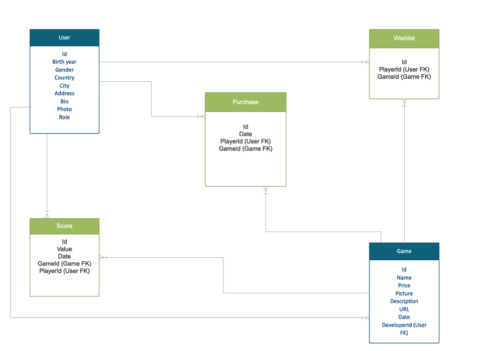
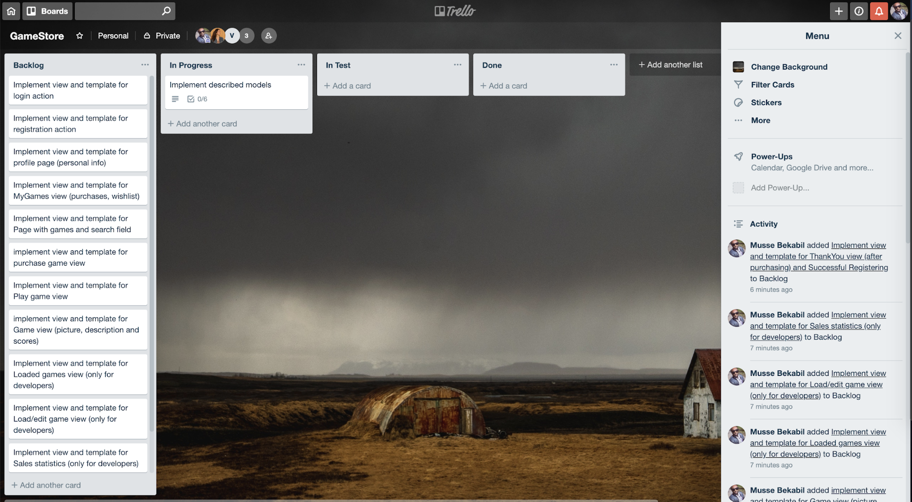
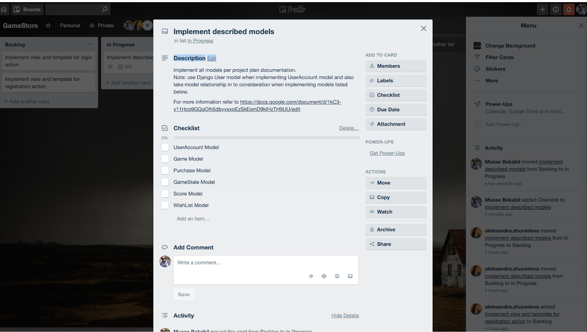

# Project Plan

## 1. Team
```
Aleksandra Zhuravleva
Vincent Eurasto
Musse Alemu
```
## 2. Goal

In this project, we will develop an online game store for JavaScript games. We aim to meet minimum requirements as well as additional ones and strive for the best grade. In addition to that, our goals are to gain experience in team development of a web project and to learn much more about the Django framework.

## 3. Plans

### 3.1. Additional requirements that we plan to implement

We are going to implement all the mandatory features first and after that if we have time we will start to implement additional features.

**1. Save/load and resolution feature (0-100 points)**

We will save and load users current game state with the window.postMessage protocol. When saving gamestate, we will use Gamestate model to save it into database.

**2. 3rd party login (0-100 points)**

We will try to integrate Facebook and/or Google authentication and authorisation to the web service. We will filter out personal information from Facebook and/or Google OAuth. So that users can use our system without the need to manually filling the registration form.

**3. RESTful API (0-100 points)**

We will implement RESTful API for the web service. The table below will summarize the API methods and endpoints.

| **Method** | **Endpoint** | **Description** |
| --- | --- | --- |
| GET | /api/games | Return list of available games in the inventory |
| GET | /api/games/{id} | Return the specified game information |
| POST | /api/games/{id} | Add new game to the inventory |
| PUT | /api/games/{id} | Update the specified game |
| PATCH | /api/games/{id} | Update the specified game partally |
| DELETE | /api/games/{id} | Delete the specified game from the inventory |
| GET | /api/users/ | Return list of users |
| GET | /api/users/{id} | Return the specified user |
| POST | /api/users/{id} | Add a new user |
| PUT | /api/users/{id} | Update the specified user |
| PATCH | /api/users/{id} | Update the specified user partially |
| DELETE | /api/users/{id} | Delete the specified user |
| GET | /api/users/{id}/purchases | Return list of all purchases related to  the specified user |
| GET | /api/users/{id}/purchases/{id}  | Return single purchase information related to the specified user |
| GET | /api/scores | Return all scores sorted by score value in descending order |
| GET | /api/scores/{id} | Return single score |
| POST | /api/scores/{id} | Add new score to scores table |
| PUT | /api/scores/{id} | Update specified  score value |
| PATCH | /api/scores/{id} | Update specified score value partially |
| DELETE | /api/scores/{id} | Delete specified score value |


**4. Social media sharing (0-50 points)**

We will integrate Facebook and/or twitter sharing options. So that players can share their favourite game and top score. The user clicking the shared link will be redirected to game marketplace.

**5. Mobile Friendly**

We will use &quot;Mobile first&quot; approach when we develop the system, i.e, we first target and design the system assuming smaller devices which can easily be customised to match bigger screens.

**6. Own game**

**7. Wishlist**

If we manage to go according to our schedule, we will have the time to implement wishlist functionality. Users will have the possibility to add games to their wishlist if they can&#39;t purchase a game right away. Also from their account there will be a possibility to see list of games from their wishlist.

### 3.2. Models

We have one model for developers and players. When you register, you are automatically a player. If you want to be a developer you need to change your status in a profile page, then you will have possibilities to stay a player (buy and play games) but also to load and edit your games.

We extend Django&#39;s User model with OneToOneField relationship in UserAccount. This model includes Purchases which are described through Purchase model and Wishlist which is presented as a list of Games. Each Game has scores which we define with Score model.

**1. UserAccount**

| Prop      | Type                                |
|-----------|-------------------------------------|
| id        | AutoField                           |
| user      | OneToOneField(extend User model)    |
| birthDate | DateField                           |
| gender    | CharField(Male, Female, Unknown)    |
| country   | CharField                           |
| city      | CharField                           |
| address   | CharField                           |
| bio       | TextField                           |
| photoUrl  | URLField                            |
| role      | CharField(Admin, Developer, Player) |

**2. Game**

| Prop        | Type                 |
|-------------|----------------------|
| id          | AutoField            |
| price       | PositiveIntegerField |
| pictureUrl  | URLField             |
| description | TextField            |
| gameUrl     | URLField             |
| date        | DateField            |
| category    | CharField            |
| developer   | ForeignKey(User)     |

**3. Purchase**

| Prop          | Type             |
|---------------|------------------|
| id            | AutoField        |
| date          | DateField        |
| buyer         | ForeignKey(User) |
| purchasedGame | ForeignKey(Game) |

**4. Score**

| Prop        | Type                 |
|-------------|----------------------|
| id          | AutoField            |
| value       | PositiveIntegerField |
| date        | DateField            |
| scorer      | ForeignKey(User)     |
| gameInScore | ForeignKey(Game)     |

**5. Wishlist**

| Prop           | Type             |
|----------------|------------------|
| id             | AutoField        |
| date           | DateField        |
| potentialBuyer | ForeignKey(User) |
| wishedGame     | ForeignKey(Game) |

**6. Gamestate**

| Prop        | Type             |
|-------------|------------------|
| id          | AutoField        |
| state       | TextField        |
| date        | DateField        |
| player      | ForeignKey(User) |
| gameInState | ForeignKey(Game) |

The figure below shows the ER modeling for our tables.



### 3.3. Views

- Register
- Login
- Profile page (personal info)
- MyGames view (purchases, wishlist)
- Page with games and search field
- Buy game view
- Play game view
- Game view (picture, description and scores)
- Loaded games view (only for developers)
- Load/edit game view (only for developers)
- Sales statistics (only for developers)
- ThankYou view (after purchasing)
- Successful Registering


## 4. Process and Time Schedule

**4.1. Process**

- We are going to start working when the third period begins. So we have 6 weeks to complete the project before the deadline.
- We don&#39;t plan to meet regularly, we will decide about meetings during the development process. For example, we found it necessary to discuss in person how our models should look like, so we had a meeting for this. For now, we plan to communicate online and make appointments if it will be necessary.
- Apart from the **Telegram** group, we have a **Google Drive** folder. We will use it for some additional documents like current schemes, tasks, notes, etc. to summarise our ideas from the Telegram chat. It is easier to find some information in one place instead of searching chat history. Moreover, we will control the development process in **Trello** , where we will assign tasks to team members as it is shown in the screenshot:



- A single card in trello will represent a small deliverable feature of the web service. In our weekly follow up meeting we will update the orders of the cards in the backlog to avoid dependencies between tasks that eventually will arise when we go deep in to the project. Moreover, we will discuss in to the details of the features&#39; implementation and update the card description to guarantee that every team member is on the same page and knows what he/she is supposed to do. Card detail will look like the screenshot below



- When team member starts working on the features, first he/she moves the task from the &quot;Backlog&quot; to &quot;In Progress&quot; column in trello and create a branch in the repository. One or more team member can participate in a feature. When the work is ready, the developer will do a pull request to another team member and move the trello card to &quot;In Test&quot; column. Then the code reviewer checks the code and run manual/automated test to guarantee that all the functionalities are implemented as expected. If everything went well, the code reviewer merges the branch to master and move the card to &quot;Done&quot; column.

**4.2. Time Schedule**

First two weeks will be hard so we should spend more on it.

**Week 1 (Jan 7 - Jan 13)**
We are going to implement a model for users and views/templates for login and registration actions, start working on some player models, views and templates.

**Week 2 (Jan 14 - Jan 20)**
We plan to develop all player and developer models, views, templates. Check first deployment process.

**Week 3 (Jan 21 - Jan 27)**
We aim to have stable models in the project at this moment, working payment service, and implement game/service interaction properly.

**Week 4 (Jan 28 - Feb 3)**
Second deployment with debug turned off; code review, working on additional requirements.

**Week 5 (Feb 4 - Feb 10)**
Finish work on additional requirements, testing, code review.

**Week 5 (Feb 11 - Feb 17)**
Final deployment to Heroku, write documentation.

**19.2.2019 midnight (end of period III) - Final submission**

**Project demonstration**


## 5. Testing

[https://docs.djangoproject.com/en/2.1/topics/testing/](https://docs.djangoproject.com/en/2.1/topics/testing/)

We will write automated unit test to test modules of the application works as expected. Additionally, having the unit test as part of the development process will guarantee that newer changes in the application is not going to break the existing functionality.

## 6. Risk Analysis

As we said in section 4.2, our first two weeks will be difficult because we are planning to implement the most part of mandatory requirements. If we don&#39;t cope with planning tasks we&#39;ll understand this early. If it happens, we will revise our time schedule and decide to devote more time to the project or we will not implement some additional requirements. Also, we will consult through Piazza to get an experience of other student groups.